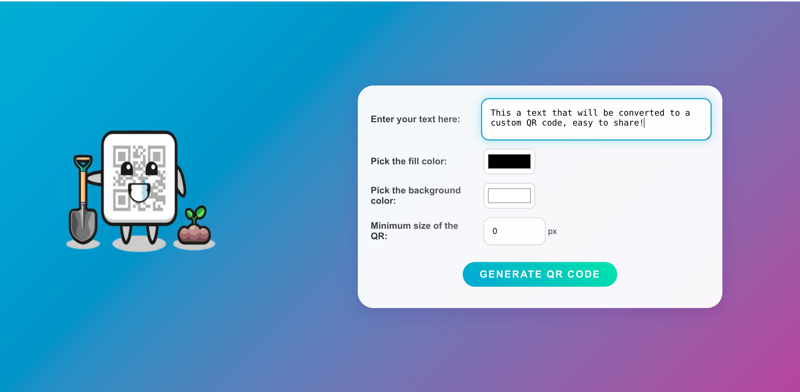

<p align="center"><h1 align="center">QR Code Generator</h1></p>
<h3 align="center">
Check out: <a href="https://qr.asiradnan.com/">https://qr.asiradnan.com/</a>
</h3>
<p align="center">Built with the tools and technologies:</p>
<p align="center">
    
    

    
</p>
<br>
<p align="center">
  
</p>

##  Table of Contents
- [Table of Contents](#table-of-contents)
- [Overview](#overview)
- [Tech](#tech)
- [Features](#features)
- [Getting Started](#getting-started)
  - [Prerequisites](#prerequisites)
  - [Installation](#installation)
- [License](#license)
##  Overview
 Make customized qr code from any text or link!.

---

## Tech
- **Backend:** Python, Django
- **Frontend:** HTML, CSS, JavaScript, Django Templates
- **Hosting:** DigitalOcean VPS, Gunicorn, Nginx


##  Features

- 📜 **Generate QR Codes Easily** – Convert any text or URL into a QR code instantly.
- 🎨 **Customizable Colors** – Choose your preferred colors for the QR code and background.
- 🖼 **High-Quality QR Codes** – Download high-resolution QR codes for large prints.
- 💡 **Free & Simple** – No costs, no complexity – just generate and share!


##  Getting Started

###  Prerequisites

Before getting started with QR Code, ensure your runtime environment meets the following requirements:

- **Programming Language:** Python
- **Package Manager:** Pip


###  Installation

Install CopyPasta using one of the following methods:

**Build from source:**

1. Clone the CopyPasta repository:
```sh
git clone https://github.com/asiradnan/QRCode
```

2. Navigate to the project directory:
```sh
cd QRCode
```

3. Install the project dependencies:


**Using `pip`** 
```sh
pip install -r requirements.txt
```

4. Run the project:
```sh
python manage.py runserver
```


##  License

This project is protected under the [MIT](https://choosealicense.com/licenses/mit/) License. For more details, refer to the [LICENSE](https://github.com/asiradnan/QRCode/blob/main/LICENSE) file.

---