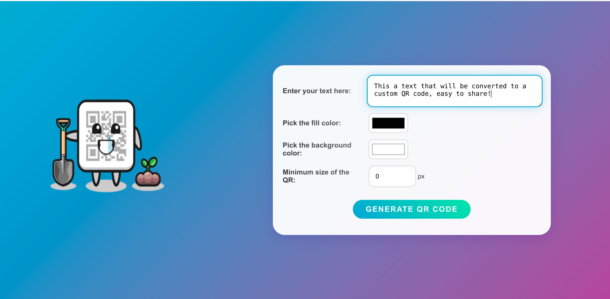
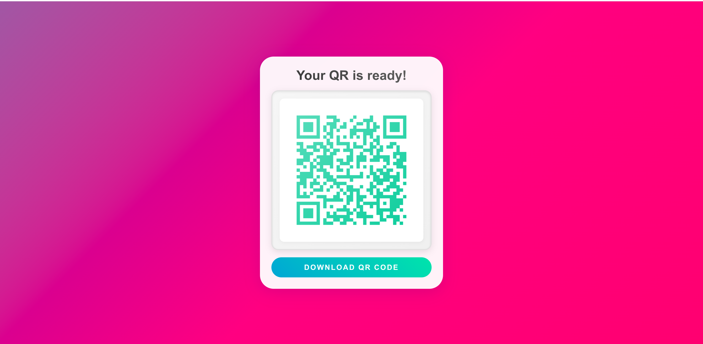

#  QR Code Generator

<!--  -->

A QR code generator web application built using Python and Django. Enter any text or URL, customize the colors, and download a high-resolution QR code instantly.

> This project was built to learn and practice Django by building a full-stack web app with server-side rendering.

## Live Link

Check out the QR Code Generator in action: [https://qr.asiradnan.com](https://qr.asiradnan.com)

## Features

- **Instant Generation:** Convert any text or URL into a QR code in one click.
- **Custom Colors:** Choose your own foreground and background colors for the QR code.
- **High Resolution:** Control the output size for large-format printing needs.
- **Downloadable:** Save the generated QR code as a PNG image.
- **No Sign-up Required:** Free to use with no account needed.

## Screenshots

## License

This project is open source under the **MIT License**.